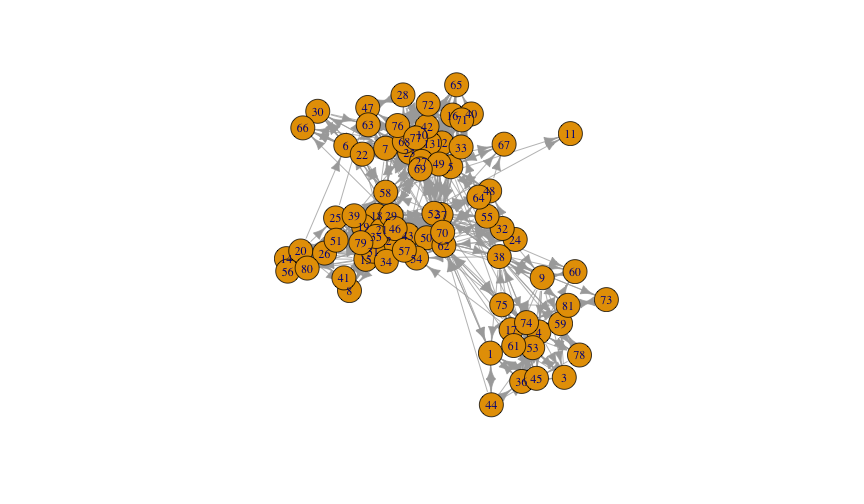
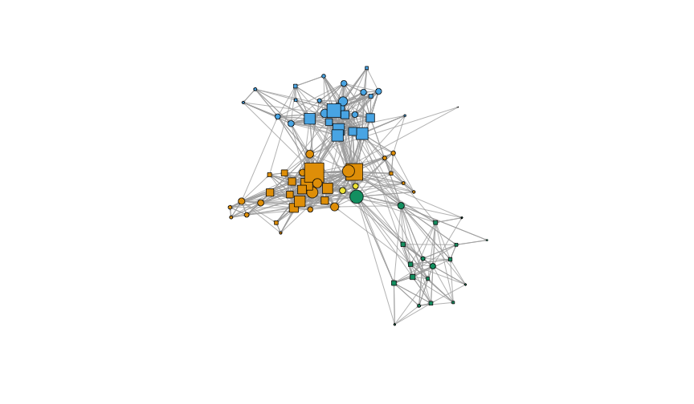
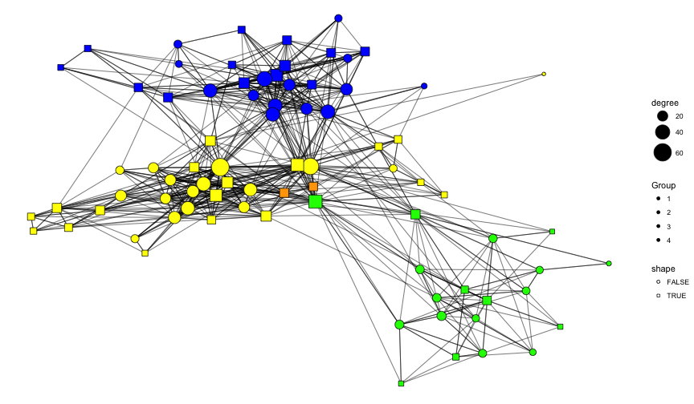
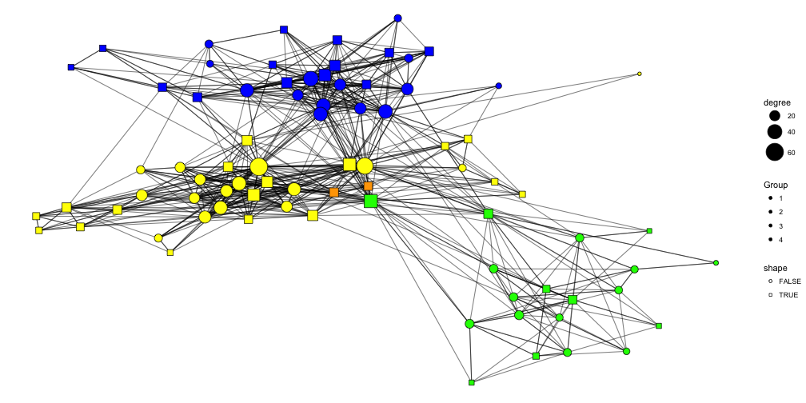
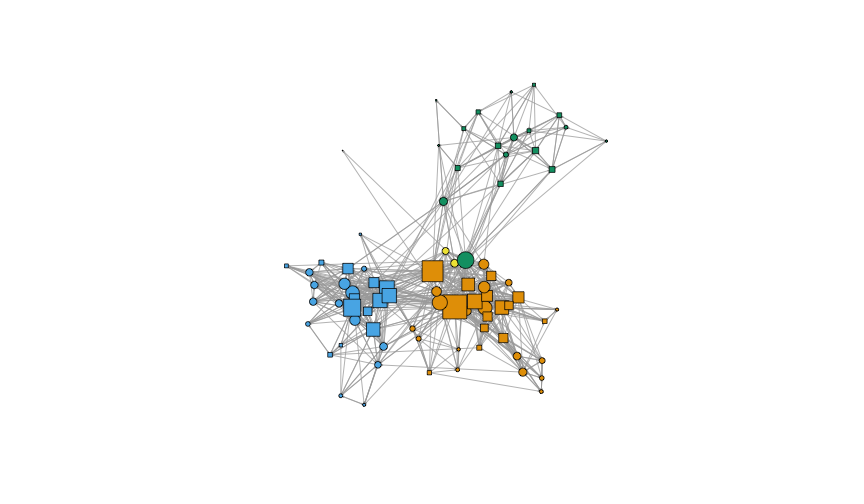
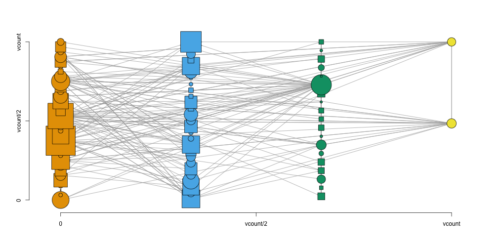

Plotting Graphs!
========================================================
author: 
date: 
autosize: true

<style>
.small-code pre code {
  font-size: 1em;
}
</style>

The Data Set
========================================================


```r
library(igraph)
library(igraphdata)
data(UKfaculty)
summary(UKfaculty)
```

```
IGRAPH 6f42903 D-W- 81 817 -- 
+ attr: Type (g/c), Date (g/c), Citation (g/c), Author (g/c),
| Group (v/n), weight (e/n)
```


Plotting As Is
========================================================

```r
set.seed(4321)
plot(UKfaculty)
```



Controlling Vertex Attributes
=======
- vertex.size
- vertex.color
- vertex.shape
- vertex.label

Controlling Edge Attributes
========================================================

- edge.color
- edge.width
- edge.arrow.size
- edge.arrow.width
- edge.lty
- edge.label

Plotting Without Changing the Data
=====
class: small-code


```r
set.seed(4321)
plot(
  UKfaculty,
  vertex.size = UKfaculty %>%
    {degree(.)/max(degree(.)) * 15},
  vertex.shape = ifelse(V(UKfaculty) %% 2 == 0, 'circle', 'square'),
  vertex.color = V(UKfaculty)$Group,
  vertex.label = NA,
  edge.arrow.size = .1,
)
```


Plotting by changing the data
=====
class: small-code

```r
set.seed(4321)
g <- UKfaculty %>%
  set_vertex_attr('size', value = degree(.)/max(degree(.)) * 15) %>%
  set_vertex_attr('shape', value = ifelse(V(.) %% 2 == 0, 'circle', 'square')) %>%
  set_vertex_attr('color', value = V(.)$Group) %>%
  set_vertex_attr('label', value= NA) %>%
  set_edge_attr('arrow.size', value = .1)

plot(g)
```



Plotting with ggraph
====
class: small-code

```r
library(ggraph)
set.seed(4321)
gg <- UKfaculty %>%
  set_vertex_attr('degree', value = degree(.)) %>%
  set_vertex_attr('Group', value = as.character(V(.)$Group)) %>%
  set_vertex_attr('shape', value = V(.) %% 2 == 0)

ggraph(gg) +
  geom_edge_link(
    alpha = .5
  ) +
  geom_node_point(
    aes(
      fill = Group,
      size = degree,
      shape = shape
    )
  ) +
  scale_size_area(max_size = 10) +
  scale_fill_manual(values = c('1' = 'yellow','2'= 'blue', '3' = 'green', '4' = 'orange')) +
  scale_shape_manual(values = c('FALSE' = 21, 'TRUE' = 22)) +
  theme_void()
```



layouts
======

```r
set.seed(1234)
l <- layout_nicely(g)
plot(g, layout = l)
```


layouts
=====

```r
g %>%
  set_vertex_attr('index', value = V(.)) %>%
  {. - V(.)[Group != 1]} %>%
  plot(., layout = l[V(.)$index,])
```



layouts
=====

```r
g %>%
  set_vertex_attr('index', value = V(.)) %>%
  {. - V(.)[Group == 1]} %>%
  plot(., layout = l[V(.)$index,])
```



layouts
=====
They're just two column matrices. 
- xmax is `vcount(g)`
- ymax is `vcount(g)`

```r
library(tidyverse)
myLayout <- map2(V(g)$Group, V(g), function(x,y){
  tibble(
    Group = x %>% as.integer(),
    index = y
  )
}) %>%
  bind_rows() %>%
  group_by(Group) %>%
  nest() %>%
  mutate(data = lapply(data, function(x){
    print(nrow(x))
    x %>%
      mutate(y = (1:nrow(.))/nrow(.))
    
  })) %>%
  unnest()
```

```
[1] 19
[1] 33
[1] 27
[1] 2
```

```r
myLayout
```

```
# A tibble: 81 x 3
   Group index      y
   <int> <int>  <dbl>
 1     3     1 0.0526
 2     3     3 0.105 
 3     3     4 0.158 
 4     3     9 0.211 
 5     3    17 0.263 
 6     3    36 0.316 
 7     3    38 0.368 
 8     3    44 0.421 
 9     3    45 0.474 
10     3    53 0.526 
# ... with 71 more rows
```

layouts
====

```r
myLayout %<>% 
  arrange(index) %>%
  select(Group, y) %>%
  mutate(Group = Group/4) %>%
  as.matrix()

myLayout 
```

```
      Group          y
 [1,]  0.75 0.05263158
 [2,]  0.25 0.03030303
 [3,]  0.75 0.10526316
 [4,]  0.75 0.15789474
 [5,]  0.50 0.03703704
 [6,]  0.50 0.07407407
 [7,]  0.50 0.11111111
 [8,]  0.25 0.06060606
 [9,]  0.75 0.21052632
[10,]  0.50 0.14814815
[11,]  0.25 0.09090909
[12,]  0.50 0.18518519
[13,]  0.50 0.22222222
[14,]  0.25 0.12121212
[15,]  0.25 0.15151515
[16,]  0.50 0.25925926
[17,]  0.75 0.26315789
[18,]  0.25 0.18181818
[19,]  0.25 0.21212121
[20,]  0.25 0.24242424
[21,]  0.25 0.27272727
[22,]  0.50 0.29629630
[23,]  0.50 0.33333333
[24,]  0.25 0.30303030
[25,]  0.25 0.33333333
[26,]  0.25 0.36363636
[27,]  0.50 0.37037037
[28,]  0.50 0.40740741
[29,]  0.25 0.39393939
[30,]  0.50 0.44444444
[31,]  0.25 0.42424242
[32,]  0.25 0.45454545
[33,]  0.50 0.48148148
[34,]  0.25 0.48484848
[35,]  0.25 0.51515152
[36,]  0.75 0.31578947
[37,]  0.25 0.54545455
[38,]  0.75 0.36842105
[39,]  0.25 0.57575758
[40,]  0.50 0.51851852
[41,]  0.25 0.60606061
[42,]  0.50 0.55555556
[43,]  0.25 0.63636364
[44,]  0.75 0.42105263
[45,]  0.75 0.47368421
[46,]  0.25 0.66666667
[47,]  0.50 0.59259259
[48,]  0.25 0.69696970
[49,]  0.50 0.62962963
[50,]  1.00 0.50000000
[51,]  0.25 0.72727273
[52,]  0.25 0.75757576
[53,]  0.75 0.52631579
[54,]  0.25 0.78787879
[55,]  0.25 0.81818182
[56,]  0.25 0.84848485
[57,]  0.25 0.87878788
[58,]  0.25 0.90909091
[59,]  0.75 0.57894737
[60,]  0.75 0.63157895
[61,]  0.75 0.68421053
[62,]  0.75 0.73684211
[63,]  0.50 0.66666667
[64,]  0.25 0.93939394
[65,]  0.50 0.70370370
[66,]  0.50 0.74074074
[67,]  0.50 0.77777778
[68,]  0.50 0.81481481
[69,]  0.50 0.85185185
[70,]  1.00 1.00000000
[71,]  0.50 0.88888889
[72,]  0.50 0.92592593
[73,]  0.75 0.78947368
[74,]  0.75 0.84210526
[75,]  0.75 0.89473684
[76,]  0.50 0.96296296
[77,]  0.50 1.00000000
[78,]  0.75 0.94736842
[79,]  0.25 0.96969697
[80,]  0.25 1.00000000
[81,]  0.75 1.00000000
```

layouts
=====
class: small-code

```r
plot(g, layout = myLayout * vcount(g), asp=0)
axis(1, at = c(-1, 0, 1), labels = c('0', 'vcount/2', 'vcount'))
axis(2, at = c(-1, 0, 1), labels = c('0', 'vcount/2', 'vcount'))
```


layouts
====
class: small-code

```r
g %>%
  set_vertex_attr('index', value = V(.)) %>%
  {. - V(.)[!Group %in% c(1, 4)]} %>%
  plot(., layout = myLayout[V(.)$index, ])
```



layouts
===
class: small-code
the layout needs to be a data frame for ggraph


```r
ggraph(gg, layout = 'manual', node.positions = data.frame(x = myLayout[,1], y = myLayout[,2])) +
  geom_edge_link(
    alpha = .5
  ) +
  geom_node_point(
    aes(
      fill = Group,
      size = degree,
      shape = shape
    )
  ) +
  scale_size_area(max_size = 10) +
  scale_fill_manual(values = c('1' = 'yellow','2'= 'blue', '3' = 'green', '4' = 'orange')) +
  scale_shape_manual(values = c('FALSE' = 21, 'TRUE' = 22)) +
  theme_void()
```


People to Watch Out For
=====

**Katerine Ognyanova**

http://kateto.net/

@ognyanova


**Thomas Lin Pedersen** 

https://www.data-imaginist.com/

@thomasp85

